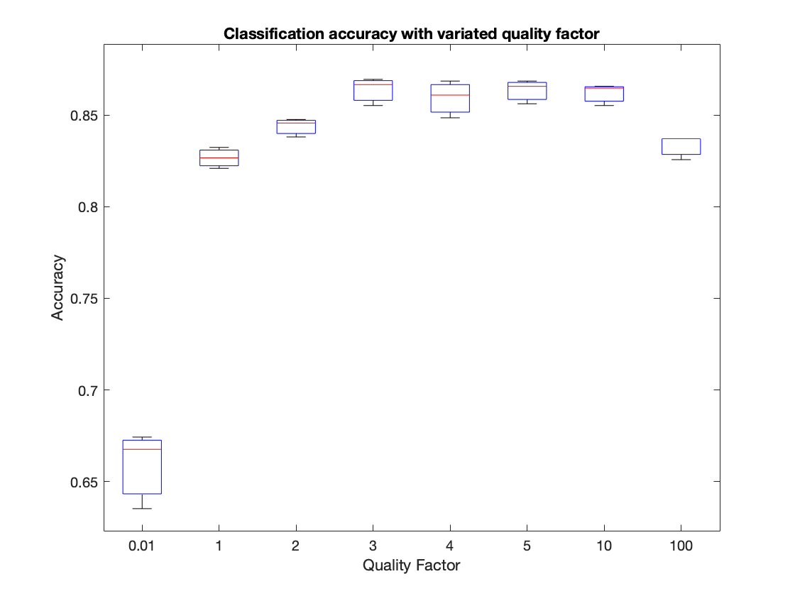

# Optimization of Keyword Spotting Systems
Conducted by Maria Gordiyenko and Nolan Tremelling under Professor Peter Kinget at Columbia University.

The aim of this research is to explore the on-chip and neural network parameters used in keyword spotting systems
such as Amazon Alexa, Siri, and Google Home. System design greatly impacts the functionality and reliability of the
produced results.

# Initial testing
The scripts in this repository were developed to allow for the processing, feature extraction, classification, and
post-classification of the dataset. The neural network chosen for this implementation is a vanilla-network described by
[Sainath, et al.](https://static.googleusercontent.com/media/research.google.com/en//pubs/archive/43969.pdf) The benefit
of such a convolution neural network is the relative improvement of false rejection rates when compared to a deep neural network.

For each parameter, nominal choices were determined a set constant. The dataset was then extracted with one parameter swept.
The parameters swept and their respective ranges are as follows:

| Parameter                | Range           |
|--------------------------|-----------------|
| Number of filters        | [2, 32]         |
| Quality factor           | [0.1, 100]      |
| Maximum center frequency | [800Hz, 4000Hz] |

The time required to train the feature extracted dataset is directly related to the number of filters.
On average, it took 1786.1 minutes to train on the CISL servers.

## Results from initial testing
Dataset classification with variated filters indicated diminishing power consumption returns after 16 filters.

At 16 filters:
- 86.381% Accuracy
- σ = 0.0052
- µ = 0.8613

Dataset classification with variated quality factor indicated diminishing power consumption returns after a quality factor of 3.

At a quality factor of 3:
- 86.667% Accuracy
- σ = 0.0076
- µ = 0.8638

Dataset classification with variated maximum center frequency indicated diminishing power consumption returns after 2000Hz.

At 2000HZ:
- 85.905% Accuracy
- σ = 0.0015
- µ = 0.8587

## Analysis of results
The results collected further elaborate on the findings of Xinghua Sun. It's emphatic to note two key observations:
- The testing for maximum center frequency completed by Sun failed to recognize that human voicings fail to commonly exceed 3kHz.
- The ≈10% variation between Sun's implementation and our MATLAB implementation is due to the reduced size of our dataset. Such a claim is consistent with the work found by [Kaplan, et al. in _Scaling Laws for Neural Language Models_](https://arxiv.org/abs/2001.08361).

Sun's implementation of the ResNet15 model using 100% of dataset:

|                          | Proposed optimization | Accuracy |
|--------------------------|-----------------------|----------|
| Number of filters        | n > 8                 | 95-96%   |
| Quality factor           | q > 3                 | 96%      |
| Maximum center frequency | F > 1000 Hz           | 95-96%   |

MATLAB implementation of "vanilla" CNN model using only 10% of dataset:

|                          | Proposed optimization | Accuracy | Corrected accuracy( 0.13 loss correction) |
|--------------------------|-----------------------|----------|-------------------------------------------|
| Number of filters        | n = 16                | 86.381%  | 97.61053%                                 |
| Quality factor           | q = 3                 | 86.667%  | 97.93371%                                 |
| Maximum center frequency | F = 2000Hz            | 85.905%  | 97.07265%                                 |

# Further Testing

## Parameter Covariation
After initial testing, it is evident that there are marginal diminishing returns after the following factors:

- 16 filters
- Quality factor of 3
- Maximum frequency of 2000 Hz

Based on this information, we propose further testing using slight variation around these parameters
to further test and find analog component optimization. The following variations have been chosen, where
two parameters are varied such that a three-dimensional mapping can be created and analyzed.

The following parameters were chosen to be covariated with the specified ranges

**Test 1, covariation of filters and maximum center frequency**
- [14, 18] filters, with a step of 1.
- Quality factor of 3.
- Maximum frequency [1800, 2200], with a step of 100.

**Test 2:**
- [14, 18] filters, with a step of 1.
- Quality factor of [2, 4], with a step of 1.
- Maximum frequency 2000.

These values will then be individually plotted to find an optimized dataset. The results of both tests will
then be summed and plotted, allowing for optimization in four dimensions.

## Analysis of results
**Covariation of filters and maximum center frequency**

There arises an interesting increase in accuracy at 15 filters with a maximum center frequency of 2000Hz. The previously proposed
optimization of 16 filters, a maximum center frequency of 2000Hz, and a quality factor of 3 produced an average classification accuracy
of 84.67% in this test. At 15 filters, a maximum center frequency of 2000Hz, and a quality factor of 3 produced an average classification
accuracy of 85.46%. While an improvement of 0.79% may be small, this improvement has potential to scale significantly due to the reduced
dataset size used in this test.

It is possible that the distribution of 15 filters rather than 16 filters more fully captures the range of voicing in the audio recordings.
This can be analyzed by exploring the area captured by the filter bank responses(?)

| Transfer functions for 15 filters:         |                                            |                                            |
|--------------------------------------------|--------------------------------------------|--------------------------------------------|
| $\frac{209.4 s}{s^2 + 209.4 s + 3.948e05}$ | $\frac{259.4 s}{s^2 + 259.4 s + 6.056e05}$ | $\frac{321.3 s}{s^2 + 321.3 s + 9.291e05}$ |
| $\frac{398 s}{s^2 + 398 s + 1.425e06}$     | $\frac{492.9 s}{s^2 + 492.9 s + 2.187e06}$ | $\frac{610.5 s}{s^2 + 610.5 s + 3.355e06}$ |
| $\frac{756.2 s}{s^2 + 756.2 s + 5.147e06}$ | $\frac{936.6 s}{s^2 + 936.6 s + 7.896e06}$ | $\frac{1160 s}{s^2 + 1160 s + 1.211e07}$   |
| $\frac{1437 s}{s^2 + 1437 s + 1.858e07}$   | $\frac{1780 s}{s^2 + 1780 s + 2.851e07}$   | $\frac{2204 s}{s^2 + 2204 s + 4.374e07}$   |
| $\frac{2730 s}{s^2 + 2730 s + 6.71e07}$    | $\frac{3382 s}{s^2 + 3382 s + 1.029e08}$   | $\frac{4189 s}{s^2 + 4189 s + 1.579e08}$   |

| Transfer functions for 16 filters:         |                                            |                                            |                                            |
|--------------------------------------------|--------------------------------------------|--------------------------------------------|--------------------------------------------|
| $\frac{209.4 s}{s^2 + 209.4 s + 3.948e05}$ | $\frac{255.7 s}{s^2 + 255.7 s + 5.886e05}$ | $\frac{312.3 s}{s^2 + 312.3 s + 8.776e05}$ | $\frac{381.3 s}{s^2 + 381.3 s + 1.308e06}$ |
| $\frac{465.6 s}{s^2 + 465.6 s + 1.951e06}$ | $\frac{568.5 s}{s^2 + 568.5 s + 2.909e06}$ | $\frac{694.2 s}{s^2 + 694.2 s + 4.337e06}$ | $\frac{847.6 s}{s^2 + 847.6 s + 6.466e06}$ |
| $\frac{1035 s}{s^2 + 1035 s + 9.641e06}$   | $\frac{1264 s}{s^2 + 1264 s + 1.437e07}$   | $\frac{1543 s}{s^2 + 1543 s + 2.143e07}$   | $\frac{1884 s}{s^2 + 1884 s + 3.195e07}$   |
| $\frac{2301 s}{s^2 + 2301 s + 4.764e07}$   | $\frac{2809 s}{s^2 + 2809 s + 7.104e07}$   | $\frac{3430 s}{s^2 + 3430 s + 1.059e08}$   | $\frac{4189 s}{s^2 + 4189 s + 1.579e08}$   |

# Using the CISL server on Mac

### Directory and commands
| Description  | Path                                        |
|--------------|---------------------------------------------|
| Dataset path | `/space1/maria+nolan/speech_commands_v0.02` |

### Logging into server
To access the server, run the following command in the terminal:

`$ ssh [username]@nalanda.cisl.columbia.edu`

followed by your account password. From there, navigate to the working directory for the project.
For this project, the following command can be run:

`$ cd space1/maria+nolan`

This will open the working directory where the Speech Commands dataset is stored. The
path to the dataset is

### Uploading large files using Git LFS

Some files in this project will exceed the 25 mb upload limit set by GitHub. To
avoid limitations in which files can be stored in the repository, it is necessary to
install Git Large File Storage.

This can be done through Homebrew, which should be installed using the following commands:

`$ /bin/bash -c "$(curl -fsSL https://raw.githubusercontent.com/Homebrew/install/HEAD/install.sh)"`

More information on Homebrew can be found here https://brew.sh/. Once Homebrew is installed,
install Git LFS by running the following command:

`$ git lfs install`

Then denote which files need to be managed. For this project, it is likely .mat files, however this
can be updated and changed as necessary.

`$ git lfs track "*.mat"`
`$ git add .gitattributes`

Committing and pushing to the repository is as normal, but larger files will now be uploaded.

### Uploading files to server using Secure Copy Protocol

To upload files from your local directory to the server, the following SCP command can be run:

`scp -r [/localDir] [username]@nalanda.cisl.columbia.edu:[/destination]`

This will upload all files in the directory to the server. To upload an individual file, use the following
command:

`scp [/localDir] [username]@nalanda.cisl.columbia.edu:[/destination]`

The difference being the use of `-r` indicating a recursive upload.

### Running Matlab on the server

To run Matlab scripts, it is helpful to create an alias that allows for quick reference to the location of Matlab.
A request has been made to make an alias. To launch Matlab in its current directory, run the following:

`/tools/tools2/mathworks/matlab_r2021a/bin/matlab`

This will launch Matlab in the terminal, where you can then run individual files using the following command:

`run myFile.m`

Note that it is necessary to ensure that all necessary files are uploaded to the same working directory. If this is not
the case, Matlab will not be able to run the script.

### Leaving scripts to run

It seems that you can leave a script to run to completion using the following:

`nohup /tools/tools2/mathworks/matlab_r2021a/bin/matlab -r 'try; DatasetFeatureExtraction;catch;save code_err; end; quit' > output.log &`

And for TraningCNN.m:

`nohup /tools/tools2/mathworks/matlab_r2021a/bin/matlab -r 'try; TrainingCNN;catch;save code_err; end; quit' > output.log &`

For whatever reason, it appears that sometimes it will run a nohup, but other times it doesn't seem to run as a nohup process.
The script, however will continue running if you do not disconnect from the session but rather allow it to expire.